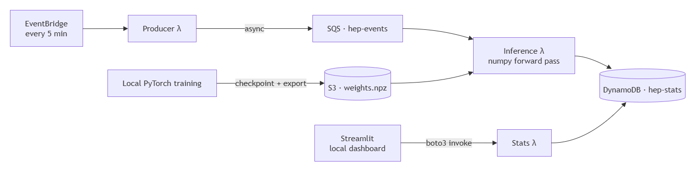

# HEP Event Trigger — Serverless ML Pipeline on AWS

A software analog of an **LHC online trigger**: a stream of simulated particle-collision events is classified in real time as **signal vs background** by a small neural network, with the results shown on a live dashboard. The model is trained offline, and the whole inference path runs **serverless on AWS** (Lambda + SQS + DynamoDB + EventBridge), provisioned entirely with Terraform.

The project is built around the [HIGGS dataset](https://archive.ics.uci.edu/dataset/280/higgs) (~11M collision events, 28 features, signal/background labels) — the canonical high-energy-physics ML benchmark.

---

## Overview

The system has two planes:

- **Online plane (serverless, deployed on AWS):** EventBridge triggers a *producer* Lambda on a schedule, which replays HIGGS events into an SQS queue. SQS triggers an *inference* Lambda that loads the trained model weights from S3 and scores each event (signal probability + live accuracy), writing rolling aggregates to DynamoDB. A *stats* Lambda exposes those aggregates to the dashboard.
- **Offline plane (local):** A PyTorch training job runs locally, checkpoints to S3 (so it survives interruption and resumes), and exports the final model weights to S3 as a NumPy `.npz` for the inference Lambda to load.



---

## Tech stack

- **AWS:** Lambda, SQS, DynamoDB, EventBridge, S3, IAM (region `eu-central-1`)
- **ML:** PyTorch (training, distributed via `torchrun`), NumPy (inference)
- **Frontend:** Streamlit
- **IaC:** Terraform (AWS + archive providers)
- **CI/CD:** GitHub Actions with OIDC (no stored AWS keys)
- **Experiment tracking (optional):** MLflow (local SQLite backend)

---

## Repository structure

```
lhc-trigger/
├── hep-trigger-ml/
│   ├── training/            # local PyTorch training
│   │   ├── train.py         # DDP + S3 checkpoint/resume + npz export
│   │   ├── model.py         # HiggsMLP (28 -> 256 -> 128 -> 1)
│   │   └── data.py          # HIGGS dataset loader
│   ├── dashboard/
│   │   └── app.py           # Streamlit; invokes hep-stats via boto3
│   ├── streaming/           # original Kafka versions (superseded by lambdas/)
│   └── k8s/                 # Kubernetes (EKS) variant — reference only
|   |── lambdas/
│       ├── producer/handler.py  # EventBridge -> batches events into SQS
│       ├── inference/handler.py # SQS-triggered -> numpy scoring -> DynamoDB
│       └── stats/handler.py     # returns rolling aggregates
├── infra/                   # Terraform: lambdas, sqs, dynamodb, s3, iam, outputs
├── bootstrap/               # Terraform: GitHub OIDC deploy role (apply once, never destroy)
├── .github/workflows/
│   └── deploy.yml           # CI: validate (push) + deploy (manual)
└── README.md

---

## Prerequisites

- An AWS account with the AWS CLI configured (`aws configure`)
- Terraform `>= 1.5`
- Python 3.12 with `torch`, `boto3`, `pandas`, `numpy`, `streamlit`, `requests` (a virtualenv is assumed below)
- The HIGGS dataset (downloaded in step 4)

---

## Run it from scratch

All commands assume the repo root `~/lhc-trigger` and an active virtualenv.

### 1. Configure AWS credentials

```bash
aws configure          # access key, secret, region eu-central-1, output json
aws sts get-caller-identity     # should print your account ID
```

### 2. (Optional) Bootstrap the CI/CD deploy role

Only needed if you want GitHub Actions to deploy. This lives in a **separate** stack so tearing down the app never deletes CI's login.

```bash
cd ~/lhc-trigger/bootstrap
# set github_repo = "your-username/lhc-trigger" in main.tf
terraform init && terraform apply
terraform output -raw gha_role_arn
```

Add the printed ARN as a GitHub repo secret named `AWS_ROLE_ARN`.

### 3. Deploy the infrastructure

```bash
cd ~/lhc-trigger
pip install numpy -t hep-trigger-ml/lambdas/inference/      # bundle numpy into the inference Lambda zip
cd infra
terraform init
terraform apply                              # creates Lambdas, SQS, DynamoDB, S3, EventBridge
BUCKET=$(terraform output -raw data_bucket)
echo "$BUCKET"                               # e.g. hep-ckpts-xxxxxxxx
```

### 4. Seed the dataset to S3

A fresh deploy gives you an **empty** bucket, so you must upload a data sample.

```bash
cd ~/lhc-trigger
wget https://archive.ics.uci.edu/static/public/280/higgs.zip
unzip higgs.zip                              # -> HIGGS.csv.gz
zcat HIGGS.csv.gz | head -n 5001 > HIGGS_sample.csv   # 5k rows just for the demo
aws s3 cp HIGGS_sample.csv "s3://$BUCKET/data/HIGGS_sample.csv"
```

### 5. Train the model locally and publish it to S3

Training runs locally and checkpoints to S3; on completion it exports `weights.npz` to S3 for the inference Lambda.

```bash
cd ~/lhc-trigger
CKPT_BUCKET=$BUCKET torchrun --nproc_per_node=1 hep-trigger-ml/training/train.py
aws s3 ls "s3://$BUCKET/model/"              # expect weights.npz
```

> Use **`torchrun`**, not plain `python` — the script uses `torch.distributed`, which needs the env vars torchrun sets. On a CPU-only machine it runs single-process on the `gloo` backend.

### 6. Push events through the pipeline

EventBridge fires every 5 minutes, but you can trigger a batch immediately:

```bash
for i in $(seq 1 5); do aws lambda invoke --function-name hep-producer /dev/null; sleep 2; done
# verify the data reached DynamoDB:
aws dynamodb get-item --table-name hep-stats --key '{"pk":{"S":"stats"}}' --region eu-central-1
```

`n > 0` means the full `producer → SQS → inference → DynamoDB` chain works.

### 7. Launch the dashboard

```bash
streamlit run hep-trigger-ml/dashboard/app.py     # opens http://localhost:8501
```

---

## CI/CD

`.github/workflows/deploy.yml` has two jobs:

- **`validate`** — runs on every push: `terraform init -backend=false && terraform validate`. No AWS credentials, creates nothing. This is the CI proof for grading.
- **`deploy`** — manual (`workflow_dispatch`) only: assumes the OIDC role and runs `terraform apply`.

---

## Design decisions & tradeoffs

**Serverless (Lambda) over Kubernetes (EKS).** The original design used EKS + MSK (managed Kafka), but those require paid EC2/broker instances and were blocked on the new AWS free plan. Serverless keeps the whole thing inside always-free limits. *Tradeoff:* Lambda can't do long-running streaming or GPU training, and cold starts add latency -> fine at this scale. The EKS manifests are kept under `k8s/` as a documented variant.

**Custom physics ML over a managed AI SaaS (e.g. Rekognition).** A managed vision/AI service would have required *no* training at all (less work), but it's a black box, isn't physics, and gives no checkpoint/resume story. Training a real HEP classifier keeps the project domain-relevant. *Tradeoff:* more moving parts —> you must train and ship a model artifact.

**NumPy inference instead of PyTorch-in-Lambda.** PyTorch + CUDA images are multiple GB and don't fit a lightweight Lambda. Instead, training exports the MLP's weights to a `.npz` and the inference Lambda does the forward pass in pure NumPy. *Tradeoff:* the NumPy forward must be kept in sync with the model architecture; this only works because the model is a small MLP.

**Local training, not cloud training.** Training runs locally with `torchrun`, checkpointing to S3 and exporting the final weights. This avoids paid GPU/compute and preserves the checkpoint/resume demo. *Tradeoff:* it's a manual step and the model is **not** part of Terraform —> after a teardown you must re-upload the sample and re-train.

**Local Streamlit, not hosted.** Streamlit is a running server, not a static page, so hosting it (App Runner/ECS) costs money and hits the same free-plan restriction. It runs locally and reaches AWS via boto3. *Tradeoff:* no shareable public URL.

**boto3 invoke instead of a public Function URL.** New AWS accounts have "block public access for Lambda Function URLs" enabled by default, so a public URL returns 403 even with a correct resource policy and `AuthType: NONE`. The dashboard invokes the stats Lambda with signed credentials instead. *Tradeoff:* the dashboard needs AWS credentials locally (fine for dev) —> and it's arguably more secure, since nothing is exposed publicly.

**SQS instead of Kafka/MSK.** SQS is always-free and gives the required asynchronous decoupling. *Tradeoff:* SQS is a work queue, not a true streaming log —> no replay, partitions, or ordering guarantees like Kafka. Acceptable for a trigger-style fan-out.

**EventBridge schedule instead of a continuous producer.** Lambda is event-driven, not long-running, so a scheduled rule drips a batch every 5 minutes to *simulate* a stream. *Tradeoff:* not truly continuous.

---

## Known limitations

- **Single aggregate row:** all stats live in one DynamoDB item. Atomic `ADD` increments are safe under concurrency, but the `recent` scores list is last-write-wins. Fine for a demo, not for production.
- **Model staleness:** warm inference Lambdas keep the previously loaded model until they recycle; a re-uploaded model is picked up on the next cold start.
- **Labels in the stream:** events carry their truth label so the dashboard can show live accuracy. A real trigger wouldn't have labels.
- **No dead-letter queue:** failed SQS messages retry and then drop.
- **Producer memory:** the producer loads the CSV sample into memory at cold start (512 MB).

---

## Possible extensions

- Add an **autoencoder** trained on background-only events; use reconstruction error as a model-agnostic **anomaly score** (new-physics hunting).
- Swap the MLP for a small **GNN** on jet constituents (ParticleNet-style).
- Move Terraform state to **S3 + DynamoDB locking** so CI can fully own deploy/destroy.
- Train on real **CMS Open Data** instead of the HIGGS benchmark for stronger domain credibility.
